# Christmas-Store

## Project Proposal

1. Clarify your target audience (Jieyu)

a. What are your application users' needs and pain points?

Our application's target users are people who need to buy decorations for their houses during the Christmas season.

Users’ Needs:
Households want to decorate their homes with Christmas trees and decorations. They are looking forward to creating a festival atmosphere at home or buying gifts for others. They need a place to shop for festival-related things.
Customers want to find the desired products as fast as possible. Visiting different stores and still don’t buy the products they want is frustrating. Customers will have a smooth shopping experience if they can find products easily.
Customers want to receive delivery service because they may not have cars with enough space to load Christmas trees. For customers with busy schedules, delivery service can save their commute time.
Customers want to buy all related things in one place. Christmas-related things have many different kinds of products, such as lights, pillows, mugs, stickers etc. It’s best if customers can buy these things all together rather than going to different stores.

Pain Points:
Many households need to buy Christmas decorations when the season is approaching. They usually have to go to different places to buy trees and decorations, which is time-consuming and energy-consuming. Our website provides a one-stop place for customers to buy Christmas-related things. They can browse all kinds of decorations on our website, place an order and wait for the delivery.

b. What problem/task(s)/need does the application help the users address?

Our application provides users with these features:
Simple and clear layout to provide the core need of customers. Customers can look through the Christmas trees and decorations on the home screen, right after they go to the website. If they see something fitted to their home, they can add it to the cart with one click.
Powerful search function. Users can use a search bar to find desired products and use filters to leaf through products within an appropriate price range. This helps to save time and money for our customers.
Quickly process to place an order. After users signup/login and add products to the cart, they can proceed to the checkout process, where they fill in the delivery address and choose a payment method. Then the order is placed. Besides, users can view their profile and order history on the profile page.
Easy management for products. We provide an admin account for owners to manage their products. They can add or delete products, and edit product info such as images, prices, descriptions etc. on the website.

2. Do some competitor research to see what other people have done to solve similar problems and explain how your group application proposes to improve existing solutions - at least one feature should be either completely new OR an improvement on the similar feature(s) of similar existing web applications. (Yichen)

As Christmas is approaching, families are looking to shopping Christmas trees and decorations. While some of them would purchase them from large franchise stores such as Canadian Tire and Walmart, others may order them online from Amazon. However, very few online store choices specialize in selling Christmas products. In comparison to some current online choices, we have come up with the following chart:

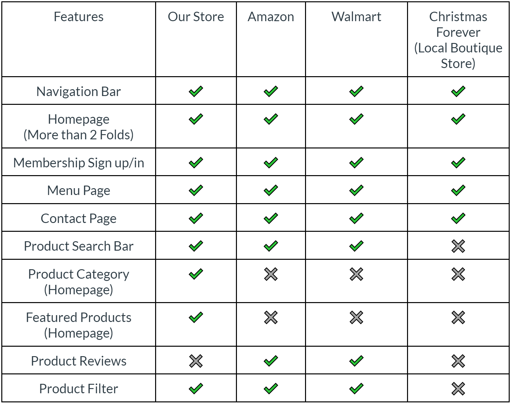

Through comparisons, we found that although giant online eCommerce platforms such as Amazon and Walmart have well-designed product filters, customer reviews, and search bars, customers may have a hard time finding specific Christmas products since they don’t have specified Christmas product filters. In addition, most of their website-featured products are not Chrisma-related as they sell millions of different products. On the contrary, the website for the local boutique Christmas store does not have a search bar and filter functionalities, which makes it hard for users to navigate between different products. Also, the website does not provide the admin user function so that all users will have the same authentications.
We aim to develop a Christmas Store website with featured products on the homepage along with product filters, a search bar, simplified Christmas product categories, and authentification that only allows admin users to add and delete products from the website.

3. Product Prototypes (Jieyu):

a. Homepage

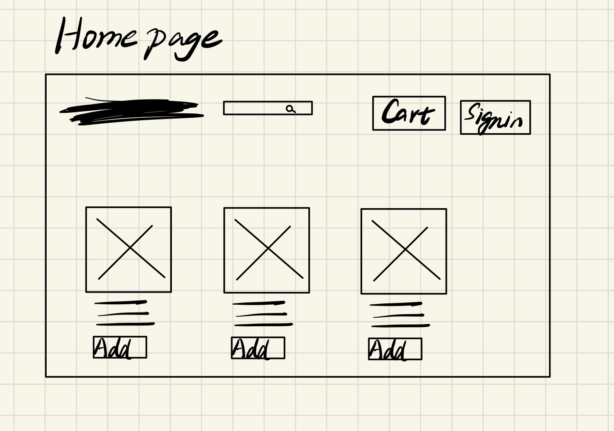

b. Detail page

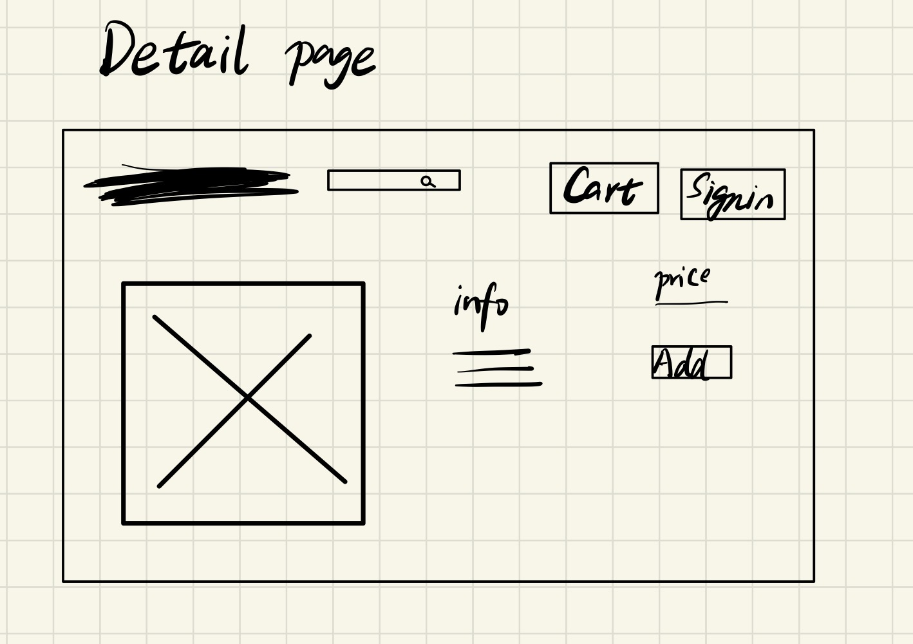

c. Cart page

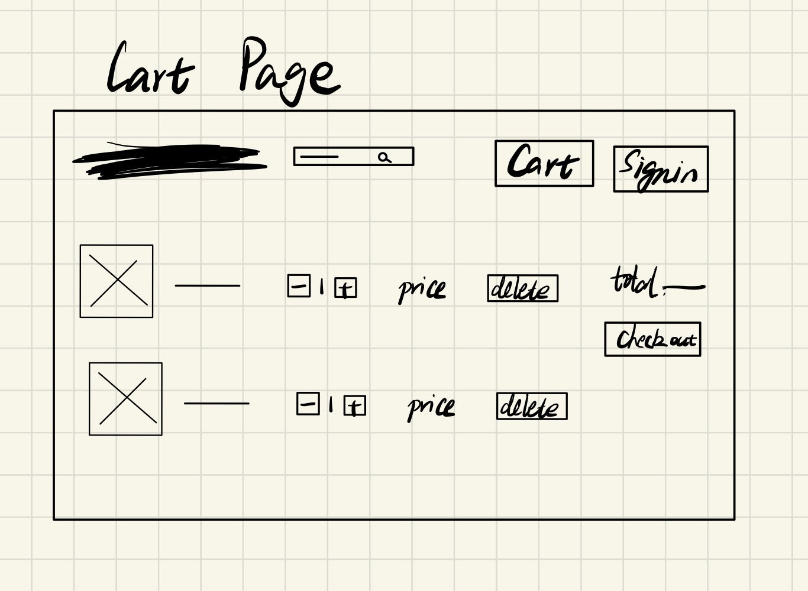

d. Order page

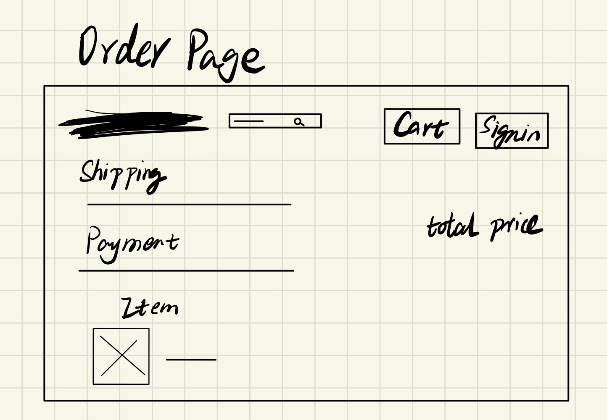

f. Search page

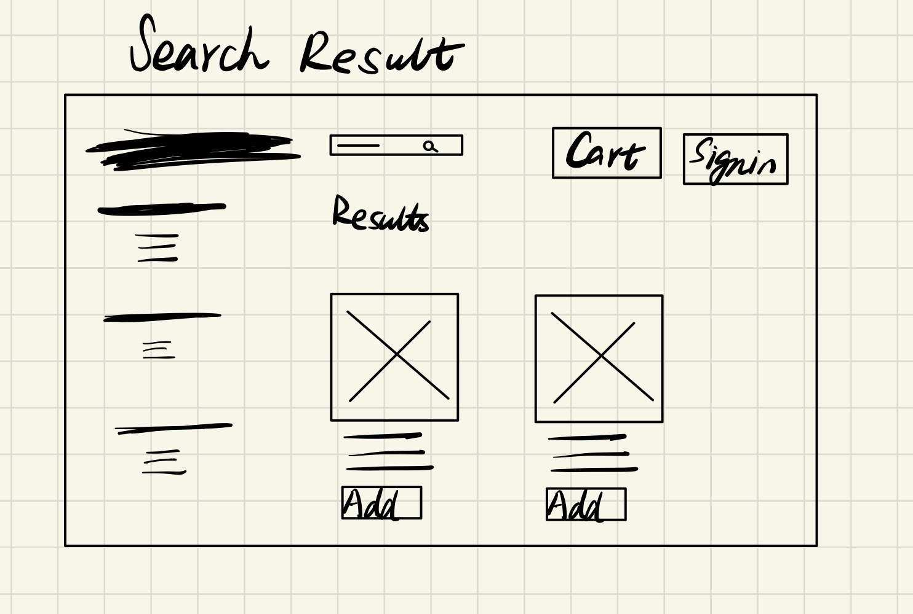

g. Profile page

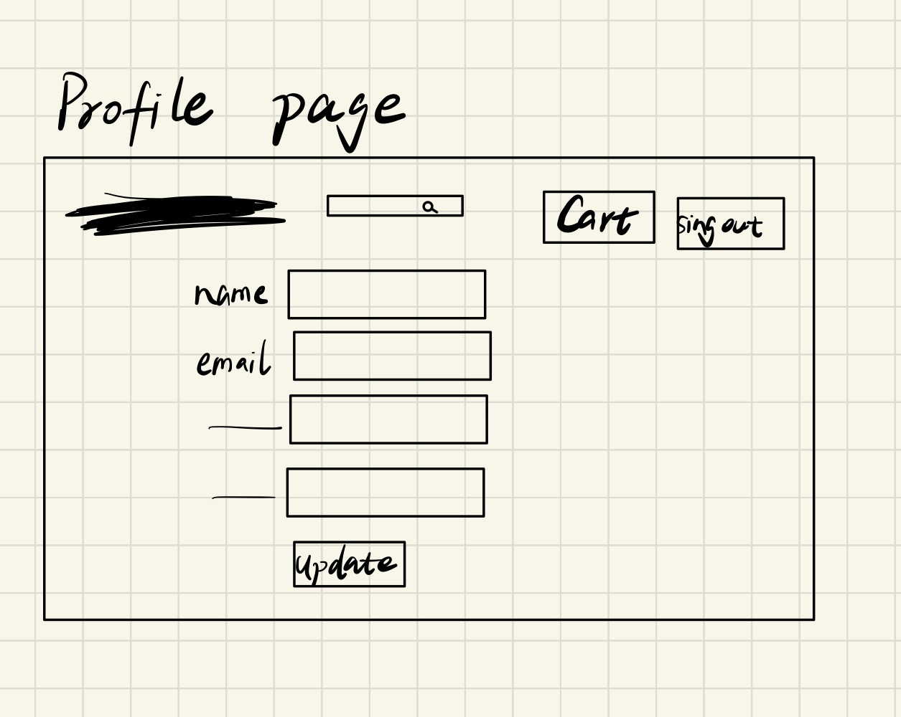

## Progress

Our deploy website:
https://christmas-store-oi00.onrender.com/

Home page:

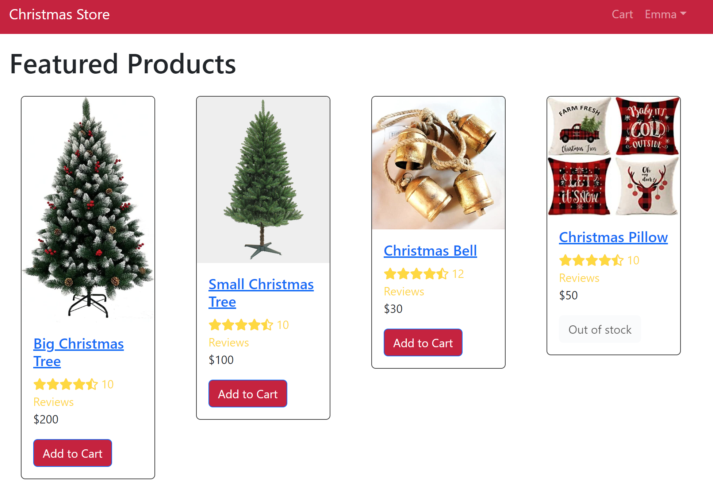

Detail page:

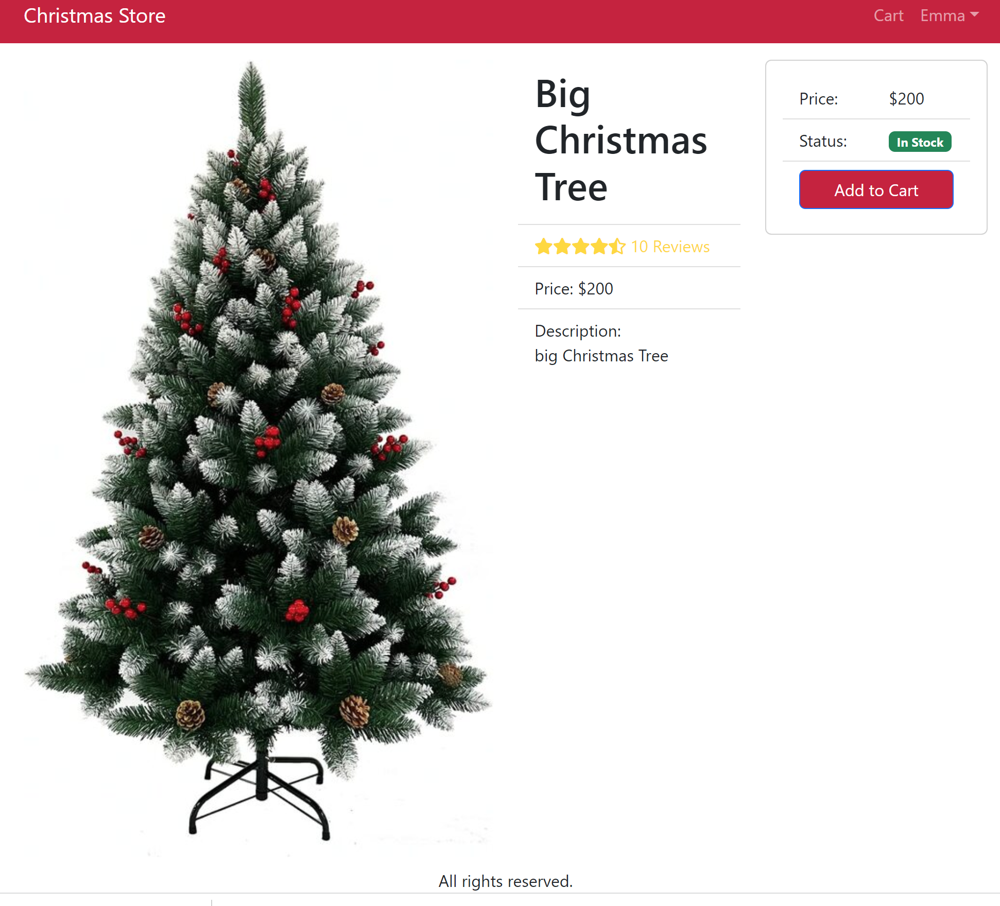

Shopping cart page:

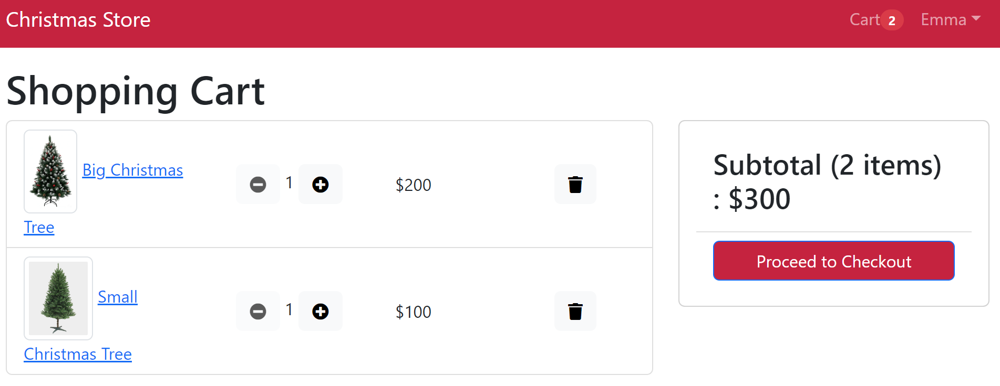

Order page:

Order history page:

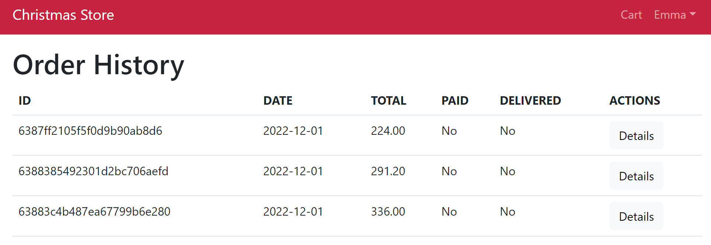

User profile page:

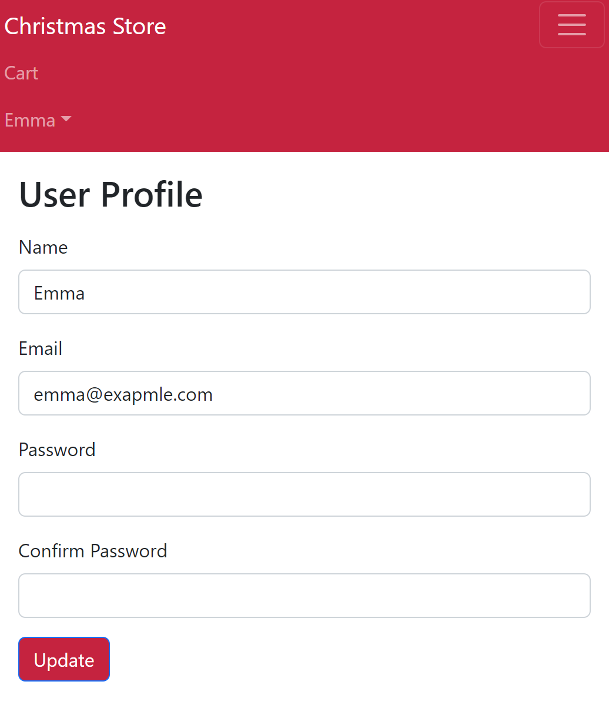

## Contribution

### Iteration 1, 2

Jieyu Bu:
Create Loading and Message Component.
Save cart's number.
Improve cart, add new item to cart.
Create CartScreen.
Create signin screen.
Connect to MongoDB in server.js.
Create product models, use routes in server.js.
Create user model, user data, seedRoute.
Create signin API.
Create order screen.
Create order history screen.
Create user profile screen.
Deploy.

Yichen Wang:
Create product and rating components.
Set up homepage.
Set up the react routes between homepage and product pages.
Create the nodeJS server and install all necessay packages.
Built up the backend data API and fetch data from the backend.
Implement useReducer to manage different states of a webpage.
Set up the footer.
Create the product screen.
Complete the sign in screen.
Create the shipping address screen.
Create the Signup screen and update the user routes.
Create the payment screen.
Complete the place order action.
Recreate the get function for the order summary page.
Update and recreate the get route for order history page.
Update the server.js for deploying.
